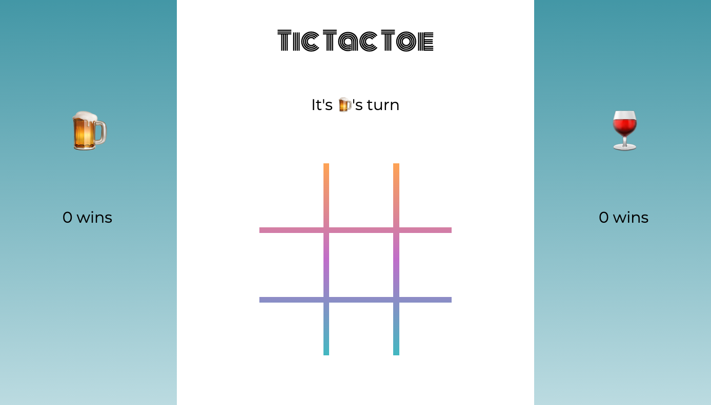
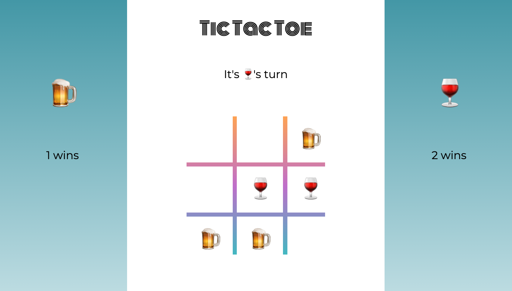

# Tic Tac Toe

### Contributors:

- [Christina Cook](https://github.com/christina-cook)

### Technologies Used:

- JavaScript
- HTML
- CSS

### Overview

The main learning goals of this project centered around solidifying and demonstrating an understanding of local storage, event delegation, and DRY JavaScript. There was a strong emphasis on creating a data model before manipulating/displaying data on the DOM. The end goal was to build a functional tic tac toe game as a front-end application.

### Code Architecture

The JavaScript for this project was divided into three separate files. The player.js file contains the Player class which stores the data for each player in addition to methods for saving and retrieving data from local storage. The game.js file contains the primary data model for the application, including the Game class and all the methods used to play each game. The main.js file is responsible for all DOM related manipulation and connects all three files together in order to display everything on the page.

### Instructions:

Playing Tic Tac Toe is easy! To play, each player takes a turn placing a token on the board by clicking an empty square. Once you get three tokens in a row, you win! If the game ends in a draw (nobody wins), the game is a tie. We keep track of your wins for you, which you'll see displayed to the left and right of the board. Feel free to end a game or close the page at any time. When you come back to play, your number of wins will still be there!

### Wins:

- Through this project, I gained a better understanding of local storage and manipulating the DOM using a data model.
- I learned how to refactor code to make it more dynamic so that I could reuse blocks of code instead of having a lot of repeats.
- I gained a better understanding of flex box and learned how to utilize grid in the CSS design.
- I was able to break down a complex problem and devise my own plan that in the end resulted in a fully-functional game!  

### Challenges:

- Thinking data model first and DOM second was a confusing concept at first, but I learned how to get the two to work together in the end.
- The game's functionality itself had its ups and downs. I often found that once I got one feature to work, another would break. I used the console in the dev tools a lot to figure out and fix bugs.
